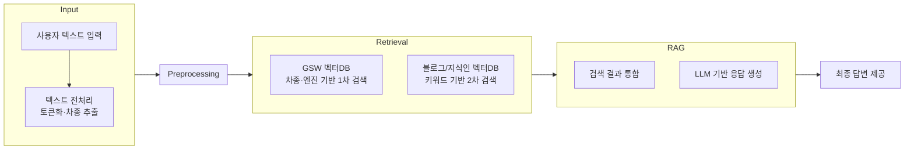
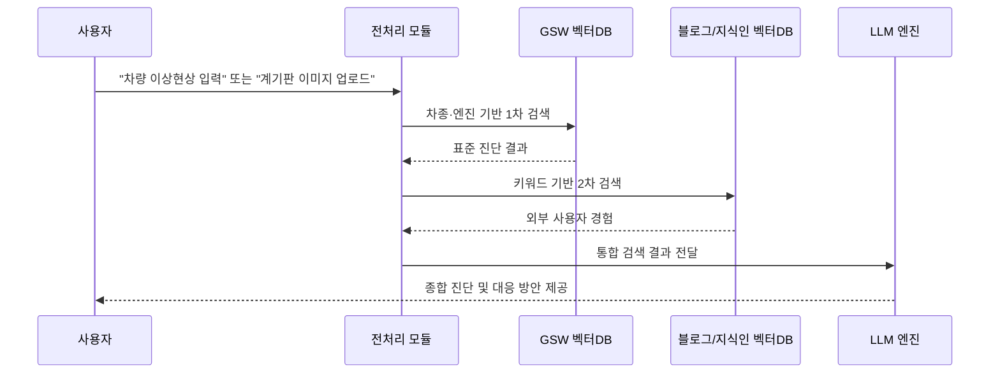

# SKN17-3rd-Team6
> SK네트웍스 Family AI캠프 17기 - 3차 프로젝트 6팀  
  개발 기간: 2025.09.08 ~ 2025.09.25

<br>

# 🔖 Conents
1. [팀 소개](#팀-소개)
2. [프로젝트 개요](#프로젝트-개요)
3. [기술 스택 & 사용한 모델](#기술-스택과-모델)
4. [시스템 아키텍쳐](#시스템-아키텍처)
5. WBS
6. 요구사항 명세서
7. 수집한 데이터 및 전처리 요약
8. DB 연동 구현 코드(링크)
9. 테스트 계획 및 결과 보고서
10. 진행 과정 중 프로그램 개선 노력
11. 수행 결과(테스트/시연 페이지)
12. 한줄 회고

<br>
<br>

# 팀 소개
### 💡 
## 구성원
| 양정민 | 전상아 | 주수빈 | 최동현 | 홍문봉 |
|------------|------------|------------|------------|------------|
| [@Yangmin](https://github.com/Yangmin3)| [@sang-a-le](https://github.com/sang-a-le) | [@Subin-Ju](https://github.com/Subin-Ju) | [@donghyun4957](https://github.com/donghyun4957) | [@Glowcloudy](https://github.com/Glowcloudy) |


<br>
<br>

# 프로젝트 개요
## 프로젝트 명
### 🚗🔧 자동차 고장 및 이상현상 정비 챗봇  

<br>

## 프로젝트 소개
본 문서는 현대/기아 **GSW 정비 매뉴얼**과 외부 데이터(네이버 블로그, 지식인)를 활용하여 차량 이상현상(진동, 소음, 경고등 등)에 대한 진단 및 **DIY 정비 가능 여부**를 안내하는 **Retrieval-Augmented Generation(RAG) 기반 챗봇 시스템**의 기술적 설계입니다.

<br>

## ✅ 프로젝트 필요성

|  |  |
|---------------------------|---------------------------|
|[소비자민원평가-자동차; AS에 민원 집중](https://www.consumernews.co.kr/news/articleView.html?idxno=739584) | [반복되는 엔진경고등에도 원인 못찾고 방치... 뒤늦게 고장 판정되면 시간ㆍ비용은 소비자 몫](https://www.consumernews.co.kr/news/articleView.html?idxno=739584) |

2025년 7월 기준, 대한민국 자동차 등록 수는 2천640만 8천대로 집계되었습니다. 대한민국 전체 인구의 절반 가량이 차량을 보유하고 있으며, 그 중 현대와 기아 자동차는 국산차 전체 판매 점유율의 92%를 차지하는 만큼 그 규모가 매우 큽니다.  

최대 판매 규모를 자랑하는 현대 자동차와 기아 자동차는 그 민원 처리 방식 역시 매우 훌륭하나, 그럼에도 불구하고 소비자들은 차량에 고장이 생겼을 경우 다음과 같은 세 가지 문제에 직면하게 됩니다.  
```
1. 고장 원인 진단 및 처리를 받았으나 정확한 원인을 알지 못하는 경우  
2. 고장 원인을 어느정도 알고 있으나 당장 서비스센터에 가야 하는지 그 심각성을 쉽게 짐작하기 어려운 경우  
3. 서비스 센터에서 고장 원인 조차 제대로 파악하지 못한 경우
```

저희의 챗봇은 이러한 문제를 겪고 있는 전국 약 2천 650만 명의 차량 보유자를 위해, 언제 어디서든 **쉽고 간편하게 고장 원인에 대해 일반 자동차 이용자도 파악할 수 있게 돕는** 챗봇을 만들게 되었습니다.  

세 가지 문제를 해결하기 위해, 저희 팀은 챗봇에 다음과 같은 기술들을 추가하였습니다.  

- **블로그/지식인 크롤링 내용**을 통해 보다 다양한 차량 고장 관련 키워드의 정보를 학습하고  
- **현대자동차/기아자동차 공식 GSW 문서**를 통해 높은 신뢰도를 갖는 정확한 고장 원인 진단 및 해결 방법에 대해 안내할 수 있도록 하며
- 사용자가 서비스 센터에서 고장 진단 및 처리를 받을 시 **정확한 이해**를 돕고자 했습니다.


<br>

## 🎯 프로젝트 목표


<br>


## 🎯 시스템 목표
- 사용자가 입력한 **이상현상 설명 또는 계기판 경고등**을 기반으로 진단 수행
- **차종·엔진 스펙을 반영한 GSW 기반 표준 진단** + **외부 사용자 경험 데이터 결합**
- 경미한 문제의 경우 **DIY 수리 절차 안내**, 중대한 문제는 **정비소 방문 권고**

<br>
<br>

# 기술 스택과 모델
## 🔧기술 스택

<br>

## 🤖 사용한 모델

<br>
<br>

# 시스템 아키텍처




## 📂 데이터 소스 및 구조화

### 1. 현대/기아 GSW (정비 매뉴얼)
PDF 정비지침서 → PDF파일 크롤링 → 텍스트 추출 → JSON 변환

- 단위: **고장진단 절차별 레코드**

- 메타데이터: ``차종``, ``엔진``, ``출처``

```json
"고장진단": [
  {
    "title": "보안 및 차량시동시스템+빌트인캠 영상 녹화 안 됨",
    "content": "퓨즈 단선/개조 확인, DVRS 고장 코드 점검, 모듈·카메라 점검",
    "type": "현대",
    "차종": "EV6(CV)",
    "엔진": "160KW+270KW(4WD)"
  }
]
```

### 2. 네이버 블로그
비공식 사용자 경험 데이터

본문 content 중심으로 **Chunk 단위 분할 및 임베딩**

```json
"문제 키워드": [
  {
    "title": "블로그 제목",
    "content": "블로그 내용",
    "type": "블로그",
    "출처": "https://blog.naver.com/example",
    "차종": null,
    "엔진": null
  }
]
```

### 3. 네이버 지식인
- Q&A 형식

- ``title(질문)`` + ``content(답변)``을 하나의 문서로 통합 후 임베딩

```json
"문제 키워드": [
  {
    "title": "질문",
    "content": ["답변1", "답변2"],
    "type": "지식인",
    "출처": "https://kin.naver.com/qna/example",
    "차종": null,
    "엔진": null
  }
]
```

## 🔍 검색 및 임베딩 전략

### 1. 임베딩 단위
- 블로그: 본문 → Chunk 분할 후 임베딩

- 지식인: 질문 + 답변 통합 → 단일 벡터 임베딩

- GSW: 고장진단 단위 → 레코드 단위 임베딩

### 2. 검색 우선순위

1. **1차 검색** : GSW (차종·엔진 기반)

2. **2차 검색** : 블로그/지식인 (차종·엔진 없음 → 공통 키워드 기반)

3. **최종 답변** : 두 검색 결과 통합 + 신뢰도 가중치 적용

## 🧩 핵심 워크플로우 (RAG 기반)


## ⚠️ 기술적 고려사항
1. **신뢰도 가중치**

- GSW > 지식인 > 블로그 순

- 외부 데이터는 신뢰도 평가 지표 필요 (예: 답변 채택 여부, 댓글 반응 등)

2. **데이터 불균형**

- 블로그/지식인 ≫ GSW → GSW 기반 검색 우선 적용

- 메타데이터 필터링 강화로 차량별 매칭 정확도 확보


3. **키워드 크롤링 한계**

- 자동차 무관 데이터 혼입 → 사전 필터링 필요

- 불필요 키워드 자동 제거 로직 포함

## 🚀 기대 효과
운전자: 정비소 방문 전 **자가 진단 가능**

정비 효율: **문제 사전 파악 → 불필요 방문 감소**

데이터적 측면: **기업 매뉴얼 + 사용자 경험 데이터 융합**

기술적 확장성: **추후 다른 브랜드 차량 GSW·포럼 데이터로 확장 가능**


