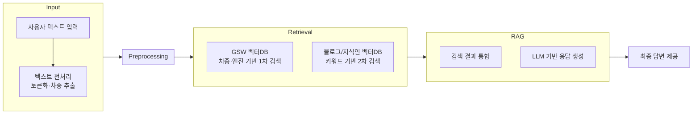
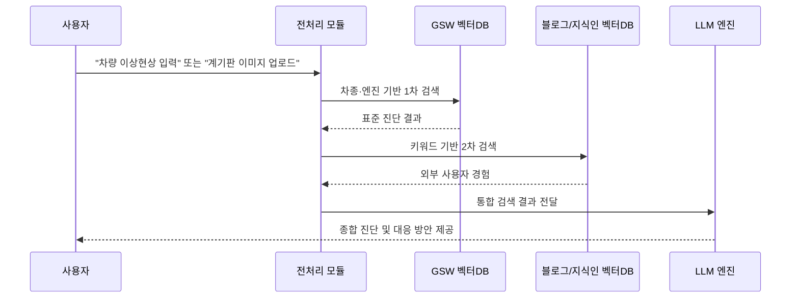

# 🚗🔧 자동차 고장 및 이상현상 정비 챗봇 – 기술 문서

## 📖 개요
본 문서는 현대/기아 **GSW 정비 매뉴얼**과 외부 데이터(네이버 블로그, 지식인)를 활용하여  
차량 이상현상(진동, 소음, 경고등 등)에 대한 진단 및 **DIY 정비 가능 여부**를 안내하는  
**Retrieval-Augmented Generation(RAG) 기반 챗봇 시스템**의 기술적 설계입니다.

---

## 🎯 시스템 목표
- 사용자가 입력한 **이상현상 설명 또는 계기판 경고등**을 기반으로 진단 수행
- **차종·엔진 스펙을 반영한 GSW 기반 표준 진단** + **외부 사용자 경험 데이터 결합**
- 경미한 문제의 경우 **DIY 수리 절차 안내**, 중대한 문제는 **정비소 방문 권고**

---

## 🏗 시스템 아키텍처



## 📂 데이터 소스 및 구조화

### 1. 현대/기아 GSW (정비 매뉴얼)
PDF 정비지침서 → PDF파일 크롤링 → 텍스트 추출 → JSON 변환

- 단위: **고장진단 절차별 레코드**

- 메타데이터: ``차종``, ``엔진``, ``출처``

```json
"고장진단": [
  {
    "title": "보안 및 차량시동시스템+빌트인캠 영상 녹화 안 됨",
    "content": "퓨즈 단선/개조 확인, DVRS 고장 코드 점검, 모듈·카메라 점검",
    "type": "현대",
    "차종": "EV6(CV)",
    "엔진": "160KW+270KW(4WD)"
  }
]
```

### 2. 네이버 블로그
비공식 사용자 경험 데이터

본문 content 중심으로 **Chunk 단위 분할 및 임베딩**

```json
"문제 키워드": [
  {
    "title": "블로그 제목",
    "content": "블로그 내용",
    "type": "블로그",
    "출처": "https://blog.naver.com/example",
    "차종": null,
    "엔진": null
  }
]
```

### 3. 네이버 지식인
- Q&A 형식

- ``title(질문)`` + ``content(답변)``을 하나의 문서로 통합 후 임베딩

```json
"문제 키워드": [
  {
    "title": "질문",
    "content": ["답변1", "답변2"],
    "type": "지식인",
    "출처": "https://kin.naver.com/qna/example",
    "차종": null,
    "엔진": null
  }
]
```

## 🔍 검색 및 임베딩 전략

### 1. 임베딩 단위
- 블로그: 본문 → Chunk 분할 후 임베딩

- 지식인: 질문 + 답변 통합 → 단일 벡터 임베딩

- GSW: 고장진단 단위 → 레코드 단위 임베딩

### 2. 검색 우선순위

1. **1차 검색** : GSW (차종·엔진 기반)

2. **2차 검색** : 블로그/지식인 (차종·엔진 없음 → 공통 키워드 기반)

3. **최종 답변** : 두 검색 결과 통합 + 신뢰도 가중치 적용

## 🧩 핵심 워크플로우 (RAG 기반)


## ⚠️ 기술적 고려사항
1. **신뢰도 가중치**

- GSW > 지식인 > 블로그 순

- 외부 데이터는 신뢰도 평가 지표 필요 (예: 답변 채택 여부, 댓글 반응 등)

2. **데이터 불균형**

- 블로그/지식인 ≫ GSW → GSW 기반 검색 우선 적용

- 메타데이터 필터링 강화로 차량별 매칭 정확도 확보


3. **키워드 크롤링 한계**

- 자동차 무관 데이터 혼입 → 사전 필터링 필요

- 불필요 키워드 자동 제거 로직 포함

## 🚀 기대 효과
운전자: 정비소 방문 전 **자가 진단 가능**

정비 효율: **문제 사전 파악 → 불필요 방문 감소**

데이터적 측면: **기업 매뉴얼 + 사용자 경험 데이터 융합**

기술적 확장성: **추후 다른 브랜드 차량 GSW·포럼 데이터로 확장 가능**